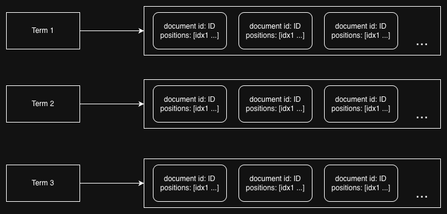

## Theory of operation

This document briefly describes how minisearch works under the hood. It serves the purpose of better understanding Minisearch machanism and also serves as a learning material for getting the picture of how search engines works.


### Inverted index - the main datastructure behind search engine

The main datastructure behind Minisearch is inverted index. It enables to efficiently find all documents containing the given term by mapping the terms to their postings list. Posting list is nothing more then collection of all documents containing the term to which the posting list is mapped and also positions of term apperances in those documents. The visual representation of it looks like that



Such structure allows for efficient retrival of documents that match the given query.


### Unicode text segmantation and Snowball stemmer - turning documents into tokens

When new document is added to Minisearch it is first analyzed and inserted into inverted index. Main process of document analysis is tokenization which is splitting the document into single unit of informations.

First all unicode words are extracted from document, for this the [unicode text segmentation](https://www.unicode.org/reports/tr29/ "unicode text segmentation") is used. After word extraction there is a step of skipping stop words, these are common, high frequency words that contribute little to the meaning of the sentence for example: "a", "an", "on" etc. After that each word is processed using [Snowball stemming algorithm](https://snowballstem.org/algorithms/english/stemmer.html "Snowball stemming algorithm"). Stemming is the process of unifying words to their single form called stem, for example Snowball Stemmer will map "connecting", "connection", "connective" and "connected" to unified form "connect". By doing so search can find all possible matches containing the word regarding it's form. This also results in smaller inverted index and overall better search performance. Such transformed words are then called tokens, for each document they are extracted with positions they appear in the document and inserted into inverted index.


### Query parsing - parsing query with custom parser

Minisearch query language is failry simple and can be handled by simple logic written with regexps and basic string manipulations. However such approach have few problems:
- error handling - it wouldn't be trivial to return descriptive error messages highlighting exact problem and place in query where it occured
- future developement - if query language grammar will evolve over time maintaining such logic will quickly result in spaghetti parser that is unmaintanable

For those reasons i decided to write small and easy parser with [chumsky](https://crates.io/crates/chumsky "chumsky") library, it offers error handling and simplicity with defining new grammar rules with great performance.


### Levenshtein automaton - fast retrieval of similar tokens

Approximate string matching (aka. fuzzy search) is the type of search that instead of searching document by exact terms given in a query can instead search for terms within specified similarity to the ones given in a query. For example in Minisearch following query will search all documents that contain word 'elephant' within similarity of 2.

```"elephant~2"```

Minisearch measures terms similarity by using Levenshtein Distance. It finds minimal number of operations needed to transform one string into another where operation can be either insertion of the new character, deletion of the character or replacement of the character. For example Levenshtein Distance between "cat" and "call" is 2 because it needs at least two operations to transform either "cat" into "call" or "call" into "cat".

```
- 1 - replace "t" in "cat" with "l" -> "cal"
- 2 - insert "l" in the end of the "cal" -> "call"
```

The fuzzy search uses Levenshtein Distance to find all tokens stored in the inverted index that are within similarity N to the searching token. Brute force approach of doing that will be iterating through all of the tokens stored in inverted index and computing Levenshtein Distance between them and search token which is highly inefficient especially with larger index. Luckily there is a lot better way of doing that.

There is a great [paper](assets/2002_Schulz.pdf "paper") describes Levenshtein DFA (Deterministic Finite Automaton). To understand how this model works first it is important to understand what DFA is, it is state machine that is:
- finite - meaning it has finite number of states
- deterministic - which means that each transition can return exactly one next state

Idea behind levenshtein automaton is to construct generic DFA structure for fixed N that can then be reused to compute Levenshtein Distance of degree N for given string, only the transitions depend on the actual string. It then accepts single character and return new state that is either:
- intermediate - Levenshtein Distance of string constructed from given characters isn't within N but it still can be within Levenshtein Distance of N after receiving new characters
- final:
    - accepting - Levenshtein Distance of string constructed from given characters is <= N
    - dead/rejecting - Levenshtein Distance > N and there is no possibility that inserting new characters will change that

Authors of the paper observed that for automaton of fixed degree N the next state can be computed by analyzing fixed window of string next characters. That observation lead to construction of characteristic vectors that defines where the input character appears in the window, they are then used to make fast decisions about next step transition.

Finding all terms that are within Levenshtein Distance of degree N to the search term with usage of Levenshtein Automaton can be done by using [Trie](https://en.wikipedia.org/wiki/Trie "Trie"). First Trie with all tokens that are stored in inverted index is constructed. Next Trie is traversed and with each step the new character is given to Levenshtein Automaton, automaton then returns state that if:
- intermediate - continue traversal
- final 
    - if acceptance - check if accepted Trie node is a word, if so return it as similar
    - if dead state - stop traversal and get back to previous node

Such technique results in way faster retrival of similar tokens then brute force approach, it checks prefixes of the tokens once and also skip huge portions of Trie by quickly detecting dead states.


### Bm25 - scoring the final results

For calculating the score of the documents included in results the [bm25](https://pl.wikipedia.org/wiki/Okapi_BM25 "bm25") function is used. Final document score is calculated by evaluating the score for each query token and then summing them together. Token score takes into account things like TF (time frequecy) - number a token appeared in document and IDF (inverse document frequency) - measurement that tells how rare token is amongs all of the documents.


### Posting list intersection - retrieving documents containing query tokens

[Posting list intersection](https://nlp.stanford.edu/IR-book/html/htmledition/processing-boolean-queries-1.html#sec:postingsintersection "Posting list intersection") is process of quickly identifying all documents that contain all query token. In minisearch this process has to support two types of intersections:
- exact - document contains exact token from query
- approximate - if query defines token minimal similarity of N, document may contain token whose Levenshtein Distance is within specified degree N to query token

To achieve that query tokens are first analyzed, if token specifies similarity threshold then Levenshtein Automaton is used to find indexed tokens within given similarity. If token similarity isn't specified then only one exact token is used. The resulting tokens are then grouped per query term.

Document matches the query if it contains at least one token from each group (OR within a group, AND across groups). It is done by creating postings iterator that merges posting lists for each group. Each group iterator maintains a min-heap containing the current document pointer for each token’s postings list, ordered by document id. This allows the iterator to return document ids containing any token from the group in ascending order.

The intersection process works by comparing the current document ids returned by each group iterator. If all document ids are the same then the intersection is found. Otherwise the maximum document id among the current one is selected and the pointers for all group iterators are advanced to the first document with id equal or greater to the current maximum. This process is repeated until any group iterator is exhausted.


### Minimal-interval semantics - checking if document match a query

Minimal-interval semantics is the process of determining if document contains query tokens in required order and sloppiness. Sloppiness is essentialy the number of extra tokens that can appear in the tokens interval. For example query:

```"oh hello world"~2```

Specifies sloppiness of 2 meaning that the document can contain 2 extra tokens in between the query tokens. So documents containing all of the following parts will match the above query:
- "oh hello world" - exact query match with sloppiness = 0
- "oh hello my world" - contains "my" between query tokens meaning sloppiness = 1
- "oh my hello hi world" - contains "my" and "hi" between query tokens meaning sloppiness = 2

The actual matching process uses the [Greedy Block](assets/EfficientLazy.pdf "Greedy Block") algorithm. From the previous posting list intersection step, for each query token we obtain a token group containing all exact or approximate tokens that appear in the document, together with their positions. The input of the algorithm therefore has the following structure:

[[{"token": "token1-sim", "positions": [1, 5, 7]}, {"token": "token1-sim2", "positions": [2, 3, 9]}], [{"token": "token2-sim", "positions": [4, 8]}], ...]

For each of this group the token group iterator is constructed. This iterator helps merges the positions for all tokens in the group and return them in ascending order. It is constructed from tokens position iterators, then min-heap is created and for each token positions iterator the first position with it's corresponding token is inserted into the heap. On each step, the smallest position is popped from the heap, and the next position from the corresponding token iterator is inserted. 

Let's take a look at an example, for following tokens group

group = [{"token": "x", "positions": [1, 4, 8]}, {"token":"y", "positions": [2, 3, 7]}, {"token":"z", "positions": [5, 6]}]


This process will look as follow

                               Create heap and insert first position         After calling next pop the first element from
                               from each iterator                            the heap and insert next position from
                                                                             corresponding token iterator

x_iterator = [1, 4, 8]         x_iterator = [4, 8]                           x_iterator = [8] <- inserted first element (4)
y_iterator = [2, 3, 7]         y_iterator = [3, 7]                           y_iterator = [3, 7]
z_iterator = [5, 6]            z_iterator = [6]                              z_iterator = [6]
                               heap = [(1,x), (2,y), (5,z)]                  heap = [(2,y), (4,x), (5,z)] <- popped first element (1)


The minimal-interval algorithm maintains a vector of current positions, one per query token, and attempts to build an ordered sequence of positions using corresponding tokens group iterators. It starts by selecting a smallest position for the first query token, then for each subsequent token selects the smallest position that is greater than the previous one.

The slop of the current interval is computed as:

slop = prev_slop + (end_position - start_position) - 1

If the slop is less than or equal to the allowed sloppiness, the algorithm advances to the next query token. If the slop exceeds the allowed value, the position of the first query token is advanced to its next available position and the process restarts. If positions are successfully selected for all query tokens, a matching minimal interval is found and returned. The algorithm continues searching until any token group iterator is exhausted, at which point no further matching intervals are possible.


### Maxscore - skipping minimal-interval semantics for non-competative documents

Calculating minimal-interval semantics is complicated process that needs extra memory allocation and complex computations. If the search returns top-k results this process can be skipped for many documents by identifying non-competitive candidates early and skipping minimal-interval evaluation for them. Minisearch uses a maxscore-style pruning strategy to achieve this. During query evaluation, the currently found results are maintained in a min-heap of size K and ordered by their final BM25 score. The smallest score in the heap represents the current threshold that a new document must exceed to enter the top-K results. For each candidate document produced by posting list intersection, an upper bound of it's possible bm25 score is computed. This bound represents the maximum score the document can achieve under perfect conditions. If the upper bound is less or equal to the minimum score in the results heap then the minimal-interval semantic is skipped since this document is not competative. Otherwise the minimal-interval semantics is computed for the document.If valid interal is found and bm25 score is greater then the minimum score in the results heap then current minimum score is removed from the heap and new document score is inserted.


### Persistence lifecycle - buffers, compression and AOF logs

Persistence in the Minisearch can be divided into two main categories:
- documents persistance
- index persistance

Let's start with documents persistance, after adding new document to Minisearch it is tokenized and then inserted into the in memory inverted index. But the actual document content isn't stored in the memory, documents are stored in segments which are binary files stored on a disk. There can be multiple segments and each one of them stores data up to specified threshold (by default 50MB). Segmenting documents in this way limits merge costs and improves cache locality. Each segment is made out of three binary files:
- data - stores the documents content
- meta - stores documents metadata
- del - stores deleted document ids and size of the document content

When saving new document, first it is compressed with lz4 compression algorithm, decision to use it was made because it is extremaly fast and still offers acceptably good compresion. Compressed document is then saved to memory buffer. After that the metadata for the document is created, it stores document id, document tokens, location - segment, offset within the segment file and size of compressed document. This metadata is encoded into binary format and stored with the u64 size prefix in metadata buffer. The document metadata object is also stored in the memory allowing fast document retrival if needed. Then if documents buffer exceeds the given threshold (by default 1MB) or last save was older then the given threshold (by default 5 seconds) then data from buffer is saved into disk.

Deletion of the document is fairly simple, when document is deleted it's id and size are written into del file.

Because data, meta and del files are AOF files no modification of already inserted data are made. Because of that after deleting significant number of documents large number of data stored on disk isn't actually used and can be safely deleted. That's why merge mechanism was introduced. During the merge, segments whose deleted documents percentage is greater or equal to a given threshold (by default 30%) are rewritten. Their data is read into memory buffers skipping all of the deleted documents and sequentially written into new segment. After this process is finished and all merged data is saved on disk in new segment the old segment is deleted.

On startup, Minisearch restores documents metadata to memory by iteratating over segments and reading their metadata. Each metadata record is read by first consuming 8 byte size prefix and then reading those number of bytes and deserializing them back into metadata object. This process is repeated untill it the end of the metadata file is reached.


Inverted index is persisted by using the append only logs that record all updates made on the inverted index and then reconstructing it on startup. Index persistance is implemented using three binary files:
- index - append only logs describing add and delete operations on inverted index
- meta - fixed size metadata associated with each log entry
- tokens - mappings between token strings and their u32 identifiers

When inverted index is updated all add and delete operations are encoded into binary format and saved into memory buffer. After buffer size exceeds threshold (by default 1MB) or last save was older then the threshold (by default 5 seconds) then logs are written to index file. For each log the associated fixed size log metadata is created, binary serialized as:

doc_id:16 bytes|offset:8 bytes|size:4 bytes

Each log however has different size and stores following informations:

- operation type (ADD or DELETE)
- u32 token identified
- number of postings associated with token after the operation
- posting that was added to inverted index (for ADD operations only)


Storing this informations and metadata of fixed size allows to reconstruct the index starting from the latest operation which allows to allocate the proper amount of memory with advance and skip insertion of documents that are deleted later.